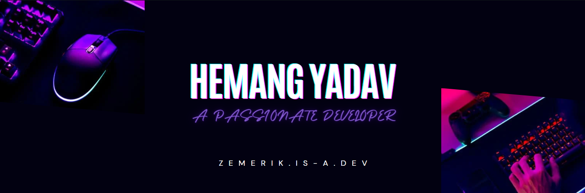
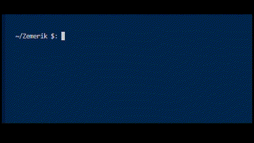
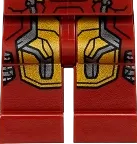

<p align = "center">
  
</p>

<br>

<p align = "center"></p>

<div align = "center">
  <details close>
    <summary>
      Click to view
    </summary>

<br>

<p align = "center">
  
</p>



<details close>
  <summary>
    ✍️Blogs
  </summary>

<!-- BLOG-POST-LIST:START -->
- [Building your Portfolio in 2025](https://dev.to/zemerik/building-your-portfolio-in-2025-218e)
- [My Journey with Hacktoberfest 2024](https://dev.to/zemerik/my-journey-with-hacktoberfest-2024-nce)
- [ZemProfiles - v2.0.1 &lpar;Prerelease&rpar;](https://dev.to/zemerik/zemprofiles-v201-prerelease-1mgd)
- [INTRODUCING ZEMPOSTS](https://dev.to/zemerik/introducing-zemposts-17nb)
<!-- BLOG-POST-LIST:END -->

</details>

<details>
  <summary>
    ⚡Recent Activity
  </summary>

<br>

<!--START_SECTION:activity-->
1. 🎉 Merged PR [#25](https://github.com/Zemerik/ZemProfiles/pull/25) in [Zemerik/ZemProfiles](https://github.com/Zemerik/ZemProfiles)
2. ❗ Opened issue [#1](https://github.com/malik-umar2/tribute2stevejobs/issues/1) in [malik-umar2/tribute2stevejobs](https://github.com/malik-umar2/tribute2stevejobs)
3. ❗ Opened issue [#157](https://github.com/GrowInCommunity/support/issues/157) in [GrowInCommunity/support](https://github.com/GrowInCommunity/support)
4. ❗ Opened issue [#5](https://github.com/rakeshid03/about-me/issues/5) in [rakeshid03/about-me](https://github.com/rakeshid03/about-me)
5. ❗ Opened issue [#1](https://github.com/princepatelcodes/react_chakra_portfolio/issues/1) in [princepatelcodes/react_chakra_portfolio](https://github.com/princepatelcodes/react_chakra_portfolio)
<!--END_SECTION:activity-->

</details>

<details>
  <summary>
    🤯Tech Stack
  </summary>

<br>


</details>

<details>
  <summary>
    📰Badges
  </summary>

<br>


  
</details>

<details>
  <summary>
    🎓My Stats
  </summary>

<br>

<table>
  <tr>
    <td>
    
  
    </td>
    <td>

  
  
  <br>
  
  
    </td>
  </tr>
</table>

<br>

</details>

</details>
</div>

<p align = "center"></p>

<br>

<p align="center">
  
  <a href = "https://x.com/Zemerik_X" style = "text-decoration:none">
    
  </a>
  
  <a href = "https://discord.gg/td5xqmzEcg" style = "text-decoration:none">
    
  </a>
  
  <a href = "https://www.linkedin.com/in/zemerik" style="text-decoration:none">
    
  </a>
  
  <a href="https://www.youtube.com/channel/UCLJY3Fa0xheb_SNSuPkbdZw" style="text-decoration:none">
    
  </a>

</p>
  
<br>

<div align = "center">
    
    
    
    
    
    
    
    
    
    
    
    
    
    
    
    
    
    
    
    
    
    
    
    
   
</div>

<br>

```js
const Zemerik = {
  name: "Hemang Yadav",
  age: "15",
  pronouns: "He" | "Him",
  code: [Javascript, Typescript, Astro, Ruby, Python, Java],
  tools: [ReactJS, NextJS, NodeJS],
  socials: {
              LinkedIN: "in/zemerik",
              X: "Zemerik_X",
              DISCORD: ".zemerik",
           },
  projects: {
               ZemProfiles: "zemprofiles.vercel.app",
               ZemPosts: "zemposts.vercel.app",
               ZemShowcase: "zemshowcase.vercel.app",
               ZemDocs: "zemdocs.vercel.app",
            },
  Fun Fact: "I spend around 5 hours on VSCode every day!",
}
```

<br>

<h2 align = "center">
  Youtube Videos:
</h2>

<div align = "center">

<!-- BEGIN YOUTUBE-CARDS -->
[](https://www.youtube.com/watch?v=l-ePe_MJU-s)
[](https://www.youtube.com/watch?v=5XyGaH9f0wA)
[](https://www.youtube.com/watch?v=6Hk0IL64H_4)
[](https://www.youtube.com/watch?v=1HVd3NTt3f8)
[](https://www.youtube.com/watch?v=YoPt46xyJpU)
[](https://www.youtube.com/watch?v=Qtm55EaAFPc)
<!-- END YOUTUBE-CARDS -->

</div>

<br>

<h2 align = "center">
  Thanks for Visiting
</h2>

<p align="center"> 
  
</p>
