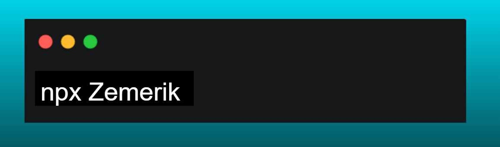

<p align = "center">
  
</p>

<br>

<p align = "center"></p>

<div align = "center">
  <details close>
    <summary>
      Click to view
    </summary>

<br>


<details close>
  <summary>
    ✍️Blogs
  </summary>

<!-- BLOG-POST-LIST:START -->
- [30 Days of Python: From Zero to Python Pro](https://dev.to/zemerik/30-days-of-python-from-zero-to-python-pro-pbj)
- [Building your Portfolio in 2025](https://dev.to/zemerik/building-your-portfolio-in-2025-218e)
- [My Journey with Hacktoberfest 2024](https://dev.to/zemerik/my-journey-with-hacktoberfest-2024-nce)
- [ZemProfiles - v2.0.1 &lpar;Prerelease&rpar;](https://dev.to/zemerik/zemprofiles-v201-prerelease-1mgd)
<!-- BLOG-POST-LIST:END -->

</details>

<details>
  <summary>
    ⚡Recent Activity
  </summary>

<br>

<!--START_SECTION:activity-->
1. 🚀 Published release [v1.0.2](https://github.com/Zemerik/Task-Runner/releases/tag/v1.0.2) in [Zemerik/Task-Runner](https://github.com/Zemerik/Task-Runner)
2. 🚀 Published release [v1.2.1](https://github.com/Zemerik/Resume/releases/tag/v1.2.1) in [Zemerik/Resume](https://github.com/Zemerik/Resume)
3. 🚀 Published release [v2.1.1](https://github.com/Zemerik/zemerik.github.io/releases/tag/v2.1.1) in [Zemerik/zemerik.github.io](https://github.com/Zemerik/zemerik.github.io)
4. ❌ Closed PR [#19](https://github.com/Zemerik/ZemPosts/pull/19) in [Zemerik/ZemPosts](https://github.com/Zemerik/ZemPosts)
5. ❌ Closed PR [#10](https://github.com/Zemerik/Portfolio-v2/pull/10) in [Zemerik/Portfolio-v2](https://github.com/Zemerik/Portfolio-v2)
<!--END_SECTION:activity-->

</details>

<details>
  <summary>
    🤯Tech Stack
  </summary>

<br>


</details>

<details>
  <summary>
    📰Badges
  </summary>

<br>


  
</details>

</details>
</div>

<p align = "center"></p>

<br>

<p align = "center">



</p>

<p align="center">
  
  <a href = "https://x.com/Zemerik_X" style = "text-decoration:none">
    
  </a>
  
  <a href = "https://discord.gg/td5xqmzEcg" style = "text-decoration:none">
    
  </a>
  
  <a href = "https://www.linkedin.com/in/zemerik" style="text-decoration:none">
    
  </a>
  
  <a href="https://www.youtube.com/channel/UCLJY3Fa0xheb_SNSuPkbdZw" style="text-decoration:none">
    
  </a>

</p>
  
<br>

<div align = "center">
    
    
    
    
    
    
    
    
    
    
    
    
    
    
    
    
    
    
    
    
    
    
    
    
   
</div>

<br>

```jsx
const Zemerik = {
  name: "Hemang Yadav",
  age: "15",
  pronouns: "He" | "Him",
  code: [Javascript, Typescript, Astro, Ruby, Python, Java],
  tools: [ReactJS, NextJS, NodeJS],
  socials: {
              LinkedIN: "in/zemerik",
              X: "Zemerik_X",
              DISCORD: ".zemerik",
           },
  myWeb: {
            Portfolio: "zemerik.vercel.app",
            Resume: "zemeriksresume.vercel.app",
            Dashboard: "zemeriksdashboard.vercel.app",
            Terminal: "zemeriksterminal.vercel.app",
            Linktree: "zemerikslinks.vercel.app",
         },
  projects: {
               ZemProfiles: "zemprofiles.vercel.app",
               ZemPosts: "zemposts.vercel.app",
               ZemShowcase: "zemshowcase.vercel.app",
               ZemDocs: "zemdocs.vercel.app",
            },
  Fun Fact: "Sunday is my most productive day!",
}
```

<br>

<h2 align = "center">
  Thanks for Visiting
</h2>

<p align="center"> 
  
</p>
