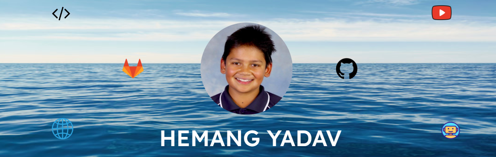

  

  

  

  

  

 

  

    

      Click to view
    

 

  

    ✍️Blogs
  

<!-- BLOG-POST-LIST:START -->
- [Basic Markdown](https://dev.to/zemerik/basic-markdown-2jel)
- [Contribute to ZemProfiles!](https://dev.to/zemerik/contribute-to-zemprofiles-16on)
- [How to make a cool GitHub README.md](https://dev.to/zemerik/how-to-make-a-cool-github-readmemd-46dj)
- [Making a good Github Profile README.md](https://dev.to/zemerik/making-a-good-github-profile-readmemd-ni0)
<!-- BLOG-POST-LIST:END -->

  

    🤯Tech Stack
  

 

  

    🎓My Stats
  

 

  

 

 

## Youtube Videos:

<table>
  <!-- YOUTUBE-VIDEOS-LIST:START --><tr><td></td>
<td><a href="https://www.youtube.com/watch?v=As7KgTZOrlE">How to update GitHub Profile README with latest blogs</a> (May 21, 2024) </td></tr>
<!-- YOUTUBE-VIDEOS-LIST:END -->
</table>

