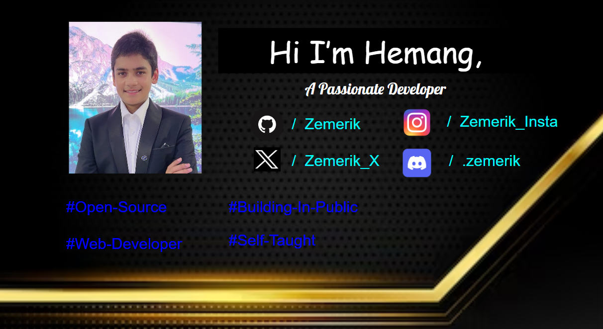

  

<h3 align = "left">About me:</h3>

<h3 align="left">Connect with me:</h3>

<h3 align="left">Tech Stack:</h3>

 

<h3 align = "left">My Stats:</h3>

&nbsp;

<h3 align = "left">Current Status:</h3>

