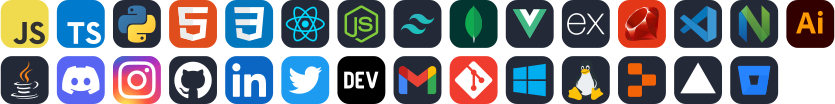

  

  

  

  
  
  
  
  
  
  
  

  
 

  

    

      Click to view
    

 

  

    ✍️Blogs
  

<!-- BLOG-POST-LIST:START -->
- [Basic Markdown](https://dev.to/zemerik/basic-markdown-2jel)
- [Contribute to ZemProfiles!](https://dev.to/zemerik/contribute-to-zemprofiles-16on)
- [How to make a cool GitHub README.md](https://dev.to/zemerik/how-to-make-a-cool-github-readmemd-46dj)
- [Making a good Github Profile README.md](https://dev.to/zemerik/making-a-good-github-profile-readmemd-ni0)
<!-- BLOG-POST-LIST:END -->

  

    📝Recent Tweets:
  

<!-- TWITTER:START -->
- [@Zemerik_X: I upload my first ever #YouTube video today🏆🏆🏆!! Feel free to check out it out👇👇 youtube.com/watch?v=As7KgT…](https://twitter.com/Zemerik_X/status/1792870166155665547)
- [@Zemerik_X: I have been invited to a Kart Racing birthday party by my friends, should I take my laptop?🤔](https://twitter.com/Zemerik_X/status/1791981753894318412)
- [@Zemerik_X: What is the most commits you did in one day? Mine: 50](https://twitter.com/Zemerik_X/status/1791745973414199793)
- [@Zemerik_X: Does your contribution graph affect your profile? Mine looks like this👇](https://twitter.com/Zemerik_X/status/1791735391516545184)
- [@Zemerik_X: What do you do when your Pull-Request is closed by the maintainers without review?](https://twitter.com/Zemerik_X/status/1791693600717410326)
<!-- TWITTER:END -->

  

    🤯Tech Stack
  

 

  

    🎓My Stats
  

 

  

 

 

## Youtube Videos:

<!-- BEGIN YOUTUBE-CARDS -->

<!-- END YOUTUBE-CARDS -->

