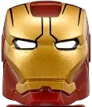

<p align = "center">
  
</p>

<br>

<p align = "center"></p>

<div align = "center">
  <details close>
    <summary>
      Click to view
    </summary>

<br>

<p align = "center">
  
</p>


<details close>
  <summary>
    ✍️Blogs
  </summary>

<!-- BLOG-POST-LIST:START -->
- [INTRODUCING ZEMPOSTS](https://dev.to/zemerik/introducing-zemposts-17nb)
- [Awesome GitHub Profile](https://dev.to/zemerik/awesome-github-profile-5bc5)
- [INTRODUCING ZEMPROFILES](https://dev.to/zemerik/contribute-to-zemprofiles-55f1)
- [How to display Latest Blogs on Github Profile?](https://dev.to/zemerik/how-to-display-latest-blogs-on-github-profile-2la5)
<!-- BLOG-POST-LIST:END -->

</details>

<details>
  <summary>
    ⚡Recent Activity
  </summary>

<br>

<!--START_SECTION:activity-->
1. 🗣 Commented on [#9](https://github.com/ahsankhan26/personal-portfolio/issues/9#issuecomment-2244952715) in [ahsankhan26/personal-portfolio](https://github.com/ahsankhan26/personal-portfolio)
2. 🗣 Commented on [#26](https://github.com/tthn0/Spotify-Readme/issues/26#issuecomment-2241802622) in [tthn0/Spotify-Readme](https://github.com/tthn0/Spotify-Readme)
3. 🔒 Closed issue [#26](https://github.com/tthn0/Spotify-Readme/issues/26) in [tthn0/Spotify-Readme](https://github.com/tthn0/Spotify-Readme)
4. 🚀 Published release [v1.0.1](https://github.com/Zemerik/Terminal/releases/tag/v1.0.1) in [Zemerik/Terminal](https://github.com/Zemerik/Terminal)
5. ❌ Closed PR [#59](https://github.com/LordDashMe/github-contribution-stats/pull/59) in [LordDashMe/github-contribution-stats](https://github.com/LordDashMe/github-contribution-stats)
<!--END_SECTION:activity-->

</details>

<details>
  <summary>
    🤯Tech Stack
  </summary>

<br>


</details>

<details>
  <summary>
    🎓My Stats
  </summary>

<br>

<table>
  <tr>
    <td>
    
  
    </td>
    <td>

  
  
  <br>
  
  
    </td>
  </tr>
</table>

<br>

</details>

</details>
</div>

<p align = "center"></p>

<br>

<p align="center">
  
  <a href = "https://x.com/Zemerik_X" style = "text-decoration:none">
    
  </a>
  
  <a href = "https://discord.gg/td5xqmzEcg" style = "text-decoration:none">
    
  </a>
  
  <a href = "https://www.linkedin.com/in/zemerik" style="text-decoration:none">
    
  </a>
  
  <a href="https://www.youtube.com/channel/UCLJY3Fa0xheb_SNSuPkbdZw" style="text-decoration:none">
    
  </a>

</p>
  
<br>

<div align = "center">
    
    
    
    
    
    
    
    
    
    
    
    
    
    
    
    
    
    
    
    
    
    
    
    
   
</div>

<br>

```js
const Zemerik = {
  name: "Hemang Yadav",
  age: "15",
  pronouns: "He" | "Him",
  code: [Javascript, Typescript, Ruby, Python, Java],
  tools: [ReactJS, NextJS, NodeJS],
  socials: {
              LinkedIN: "in/zemerik",
              X: "Zemerik_X",
              DISCORD: ".zemerik",
           },
  projects: {
               ZemProfiles: "zemprofiles.vercel.app",
               Sports Stadium: "zemerik.is-a.dev/Sports-Stadium",
               Portfolio; "zemerik.vercel.app",
            },
  Fun Fact: "I am currently exploring Python & Pygame",
}
```

<br>

<h2 align = "center">
  Youtube Videos:
</h2>

<p align = "center">

<!-- BEGIN YOUTUBE-CARDS -->
[](https://www.youtube.com/watch?v=YoPt46xyJpU)
[](https://www.youtube.com/watch?v=Qtm55EaAFPc)
[](https://www.youtube.com/watch?v=As7KgTZOrlE)
<!-- END YOUTUBE-CARDS -->

</p>

<br>

<h2 align = "center">
  Thanks for Visiting
</h2>

<p align="center"> 
  
</p>
